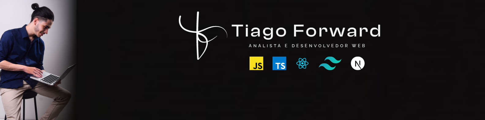

## 👨‍💻 About Me

I'm a Front-end Developer with a degree in Systems Analysis and Development, experienced in building modern web applications using React, Next.js, TypeScript, and other technologies from the JavaScript ecosystem.

Currently, I work on digital product development, contributing to the implementation of new features, responsive interface creation, API integrations, and the continuous improvement of applications across different domains.

I enjoy transforming business requirements into intuitive and efficient solutions, always focusing on clean code, componentization, reusability, scalability, and delivering great user experiences.

Beyond front-end development, I have a strong interest in software architecture, Clean Architecture, Domain-Driven Design (DDD), and back-end development with technologies such as NestJS and Prisma. I'm continuously learning and expanding my knowledge to build scalable, maintainable, and well-structured applications.

I'm always looking for opportunities to learn, improve my skills, and create software solutions that combine quality, performance, and great user experiences.

## 💻 My Hard Skills

 

  
  
  
  
  
  
  
  
  
  
  
  
  
  
  

<h2>🛠️ Software and Development Tools</h2>

  
  
  
  
  
  

## 📈 Contribution Activity

  
  
  

